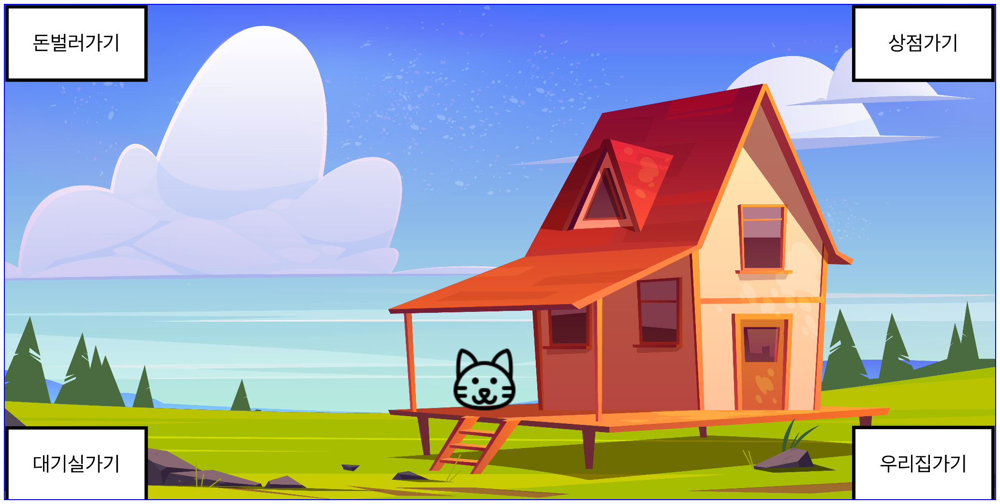
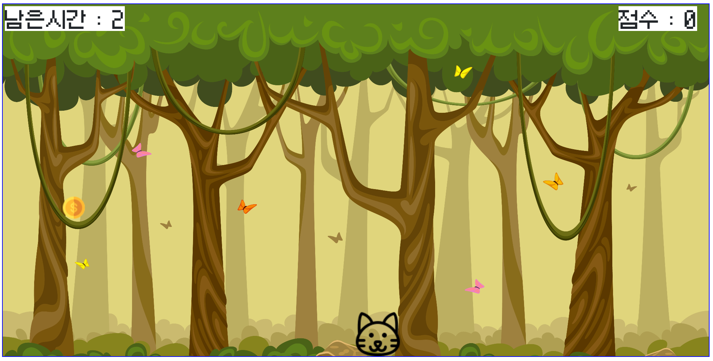

# GrabMoneyGame
Vanilla javascript로 구현한 돈줍기 게임입니다.<br>
구현기간 : 2022년 6월 11일 ~ <br>
사용언어 : HTML/CSS/Javascript <br><br>

## 게임설명
고양이가 개발자가 될 수 있도록 모든 장비를 사주면 게임이 종료됩니다! <br>
하늘에서 떨어지는 돈을 주워 돈을 벌 수 있습니다. <br>
상점에서 장비를 구매할 수 있습니다. <br><br>

## 게임방법
1. 브라우저의 넓이를 최소 1100px로 지정해주세요 <br>
2. https://jirongkim.github.io/GrabMoneyGame/ 접속 <br>
3. 키우고자하는 고양이의 이름을 입력하세요. <br>
4. 키보드 방향키를 이용하여 게임을 진행하실 수 있습니다. <br><br>

## 기능설명
1. 고양이와 돈은 Class를 이용하여 생성하였습니다.<br>
Class를 이용하니 자주 생성되는 Money를 쉽게 만들고 그릴 수 있었습니다.
```
class Man{
  constructor(){
    this.x = canvas.width / 2;
    this.y = canvas.height - 64;
    this.width = 64;
    this.height = 64;
  }
  draw(){
    ctx.drawImage(man_image, this.x, this.y, this.width, this.height);
  }
}

class Money{
  constructor(x, y = 10){
    this.x = x;
    this.y = y;
    this.width = 32;
    this.height = 32;
  }
  draw(){
    ctx.drawImage(money_image, this.x, this.y, this.width, this.height);
  }
}
```

<br><br>


2. 고양이가 돈을 주웠는지를 판별하는 collision check 함수입니다.<br>
모든 돈 객체를 한번씩 돌면서 호출합니다. (아래 코드에서 element는 돈입니다)<br>
만약 충돌이면 게임점수를 더합니다.<br>
```
function collisionCheck(element){
   var comX;
   if(icon_man.x > element.x){
     comX = icon_man.x - (element.x+element.width);
   }
   else{
     comX = element.x - (icon_man.x+icon_man.width);
   }
   var comY = icon_man.y - (element.y+element.height);
   if(comX <=0 && comY <= 0){
     GameInfo.score++;
     return true;
   }
   return false;
 }
```

<br><br>

3. localStorage를 이용하여 재접속시에도 현금과 고양이의 장비는 유지됩니다.<br>
게임이 종료될 때마다 localStorage money에 게임 스코어를 추가로 더합니다.<br>
```
var havingMoney = window.localStorage.getItem('money');
window.localStorage.setItem('money', Number(main.GameInfo.score) + Number(havingMoney));
```
<br><br>

## 전체 디자인


